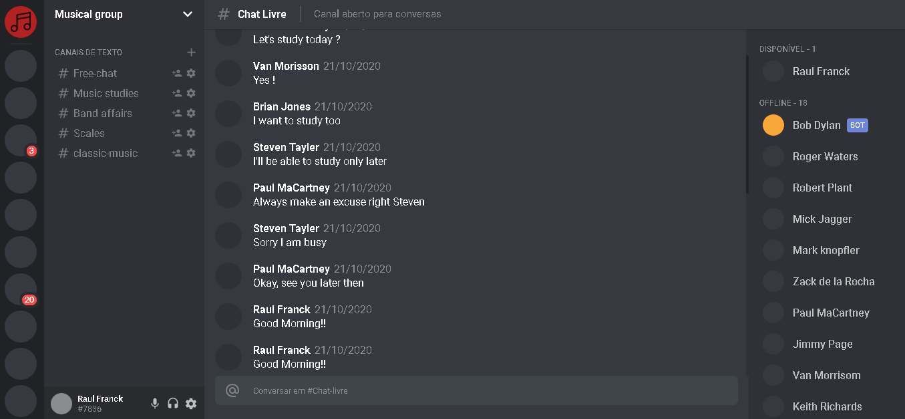

<h1 align="center">
    
</h1>

<h4 align="center">
  🚀 Discord Clone
</h4>

<p align="center">
<a href="#-projeto">Projeto</a>&nbsp;&nbsp;&nbsp;|&nbsp;&nbsp;&nbsp;
  <a href="#rocket-tecnologias">Tecnologias</a>&nbsp;&nbsp;&nbsp;|&nbsp;&nbsp;&nbsp;  
  <a href="#-layout">Layout</a>&nbsp;&nbsp;&nbsp;|&nbsp;&nbsp;&nbsp;
  <a href="#zap-executando">Executando</a>&nbsp;&nbsp;&nbsp;
</p>

<br>

## 💻 Projeto

Discord clone made in react and typescript developed to study the styled-components library 

<div align="center">
  
  
</div>

## 🚀 Tecnologias

This project was development witch the following technologies:

- [React](https://reactjs.org)
- [TypeScript](https://www.typescriptlang.org/)
- [styled-components](https://styled-components.com/)


## 🎨 Layout

Acesse the project: [View](https://condescending-mcclintock-2aed86.netlify.app/)

## :zap: How to use ?

For execute this aplication


1 - in a terminal, into the root **/clone-discord** and run the comand

```
$ yarn install
```

2 - still at the root, run the comand 

```
$ yarn start
```

do this and open the browser with the project in port  http://localhost:3000

---

Made with ♥ by Raul Franck :wave: [Get in touch!](https://www.linkedin.com/in/raul-franck-468617164/)
